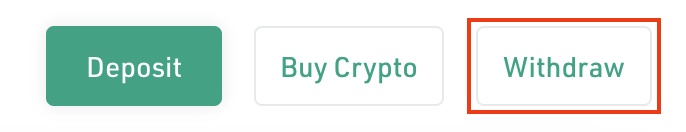

# Bridging from BNB Chain with the eSpace Bridge

The eSpace Bridge is a cross-space and cross-chain bridge, that allows you to transfer CFX and other tokens between across spaces (Core Space and eSpace) and across chains (eSpace and BNB Chain).

In this guide, we'll bridge CFX from **BNB Chain** to **Conflux eSpace** through the eSpace Bridge.

## Prerequisites

* Your MetaMask wallet connected to Conflux eSpace and BNB Chain.
* A BNB Chain account funded with bCFX and BNB.
* A Conflux eSpace account funded with CFX to pay for transaction fees.

## Bridging CFX to BNB Chain to Conflux eSpace with the eSpace Bridge

1. Go to [ConfluxHub](http://confluxhub.io).
2. Ensure that you're in the eSpace Bridge.\
   .png>)
3. In the **Between BSC and eSpace** box, click **Go**.\
   .png>)
4. Click **Connect MetaMask** to connect your MetaMask wallet.\
   .png>)
5. In your MetaMask notifications, select the account that you want to connect and click **Next**.\
   
6. In the **Connect to My Conflux...** notification, click **Connect** to confirm the connection of MetaMask to the eSpace Bridge (ConfluxHub) site.\
   .png>)
7. In the token field, select **bCFX (BSC Conflux)**.\
   .png>)
8. In the amount field, enter the amount of bCFX that you want to bridge from BNB Chain to Conflux eSpace, then click **Approve**.\
   .png>)
9. In the MetaMask notification, click **Confirm** to give permission to the eSpace bridge to transfer your tokens.\
   .png>)
10. Once, the approval is submitted, click **Send** to start sending your bCFX to Conflux eSpace.\
    .png>)
11. In the MetaMask notification, click **Confirm** to confirm the transaction.\
    **Note**: This transaction may take some seconds or up to a minute.\
    .png>)
12. Once you receive the notification that your tokens are claimable, go to MetaMask and switch to the Conflux eSpace network.\
    .png>)
13. In the eSpace Bridge, click **2** to start claiming your funds in Conflux eSpace.\
    .png>)
14. In 2 - Claim CFX, you'll see your claimable funds on eSpace. Click **Claim** next to your funds.\
    .png>)
15. Now, go to MetaMask and click **Confirm** to confirm the transaction.\
    **Note**: This transaction may take some seconds or up to a minute.\
    .png>)\

Your funds were now successfully bridged to Conflux eSpace!
