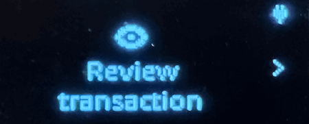

# Using Your Ledger Hardware Wallet with Nucleon


Support for Conflux eSpace in Ledger devices is currently under review.


You can also use your [Ledger](https://ledger.com/) hardware wallet to trade on Nucleon, even before the official Conflux eSpace app on Ledger is released. To accomplish this, we'll need to enable blind signing in the Ethereum app of your Ledger device.

## Prerequisites

* Connect your Ledger wallet to MetaMask or Wallet Connect. See [_Using Ledger with MetaMask on Conflux eSpace_](https://developer.confluxnetwork.org/guides/en/using\_ledger\_on\_espace/) __ to learn how_._ For the purposes of this guide, we'll use MetaMask.
* Enable Blind "smart contract data" or "blind signing" on your Ledger device. To learn more about bling signing, refer to [this article](https://www.ledger.com/academy/cryptos-greatest-weakness-blind-signing-explained) on Ledger's Academy portal.

## Enabling Blind Signing on your Ledger Device

1. Go to the **Ethereum** app in your Ledger device.
2.  In the Ethereum app, go to **Settings**.

    <figure><figcaption></figcaption></figure>
3.  **Enable** the blind signing option.

    <figure><figcaption></figcaption></figure>

You have just enabled blind signing in your Ledger device!

## Using Nucleon with Your Ledger Hardware Wallet and MetaMask

To use Nucleon with your Ledger wallet:

1. Go to Nucleon.
2.  Connect your imported account from Ledger to Nucleon.

    *   Select the account from your Ledger device and click **Next**.

        <figure><figcaption></figcaption></figure>
    * Confirm the connection to MetaMask by clicking **Connect**.

3. Go to Nucleon, make a transaction.                                           
4. In the MetaMask notification, review the transaction details and click **Confirm**. 
5. Now, plug-in your Ledger device to your computer.
6. Unlock your device and open the Ethereum app.
7.  Review the transaction details and confirm the transaction by pressing the two buttons in Accept and Send.

    <figure><figcaption></figcaption></figure>

You have just used Nucleon from your Ledger account!
